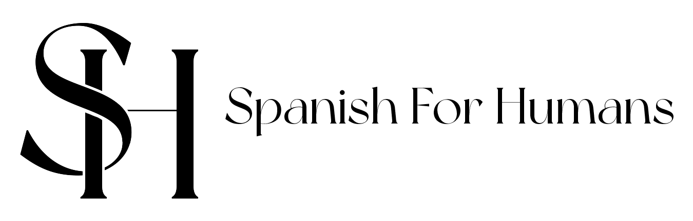

# Spanish for Humans



## Introduction

Welcome to **Spanish for Humans**, a React-based project designed to provide language learning resources with a human touch. Whether you're a beginner or looking to enhance your Spanish language skills, this project aims to make the learning experience enjoyable and effective.

## Installation

Before you start, make sure you have [Node.js](https://nodejs.org/) installed on your machine.

1. **Clone the repository:**

    ```bash
    git clone https://github.com/your-username/spanish-for-humans.git
    ```

2. **Navigate to the project directory:**

    ```bash
    cd spanish-for-humans
    ```

3. **Install dependencies:**

    ```bash
    npm install
    ```

## Getting Started

To run the project locally, use the following command:

```bash
npm start
```

# Editing this README

This will start the development server, and you can view your app at http://localhost:3000.

## Name
Spanish For Humans

## Description
At Spanish for Humans, we believe that learning a language should be fun, relaxed, and tailored to your unique needs. Whether you're starting with basic words or preparing for a test like DELE, exploring Spanish for tourism, delving into Spanish for teachers, or even indulging in the flavors of Mexican cooking, our approach is designed to suit every age and proficiency level.

If the rigid structure of formal education doesn't align with your lifestyle, you've found the perfect place. Our goal is to create an environment where you can not only learn but truly enjoy the journey at your own pace.

Ready to embark on a Spanish learning adventure? Contact me for a free trial lesson, and let's explore the beauty of the Spanish language together!

¡Bienvenidos a Spanish for Humans!

## Project Structure

- src: Contains the source code for the project.
- public: Static assets and HTML template.
- node_modules: Node.js dependencies.

## Dependencies

- @emailjs/browser: Used for email functionality.
- @emotion/react: Library for styling React components.
- @mui/material: React components following Material-UI design principles.
- @testing-library/react: Testing utilities for React.
- aos: Animate on Scroll library.
- framer-motion: Animation library for React.
- localforage: Library for offline data storage.
- react-icons: Library providing popular icons for React applications.
- react-router-dom: Routing library for React.
- react-scripts: Configuration and scripts for Create React App.
- react-scroll: Smooth scrolling for React applications.
- react-slick: Carousel component for React.
- react-touch-carousel: Carousel component with touch support.
- slick-carousel: Carousel component for web applications.
- web-vitals: Library for measuring web vitals metrics.

## Scripts

- start: Start the development server.
- build: Build the production-ready application.
- test: Run tests.
- eject: Eject from Create React App configuration.

## Contributing
If you'd like to contribute to this project, please follow our Contribution Guidelines.

## Roadmap
- [ ] Integration of a formal "contact me" form.

## Authors and acknowledgment

# Authors
- Fabian V.
- Sergio R.

# Acknowledgment
- Arely S. (Design)

## License
License
This project is licensed under the MIT License. May change.

## Project status
On development for version 1.0

Happy Learning!